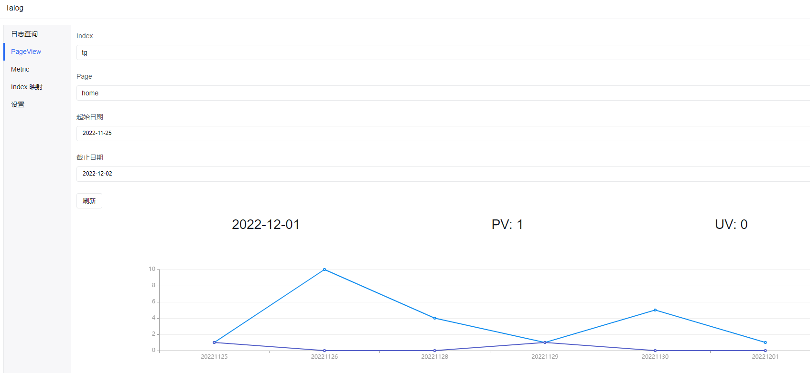
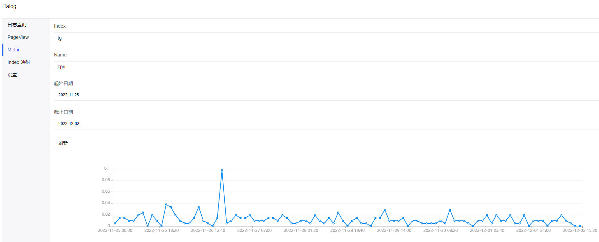

# V.Talog

Talog 是由木叉一人工作室开发的单机日志解决方案，主要是想解决小微项目日志排查不方便的问题，并且 Talog 还支持 PageView、Metrics 的记录。

### 核心思想

Talog 借鉴了 [Loki](https://github.com/grafana/loki) 的想法，为日志打上标签，分块存储，一条日志可以有多种标签，Talog 会把具有相同标签的日志放在同一个文件中，这个文件在 Talog 中被称为 Bucket。Talog 还会使用 Index 将同一个维度下的(同一个项目或者同一块业务) Buckets 组织起来，并且为每一种标签都建立一个字典树 Trie 用于后续查找日志时使用。在通过 Trie 查找到 Bucket 之后，底层代码会将 Bucket 下所有的日志都取出，因此在使用 Talog 时，需要对日志做好细致的标签化，来保证 Bucket 不会太大，导致查询日志时速度缓慢。在 V.Talog.Extension 扩展中，支持对 Bucket 中的日志进行进一步的处理，比如在日志索引时，可分为单行日志、多行日志、json 日志，并且在日志查询时，支持对日志进行正则表达式匹配。正则表达式匹配出来的字段以及 json 日志中的字段，也都支持进一步的筛选。

## V.Talog.Core

V.Talog.Core 是 Talog 项目的核心部分，主要实现底层的日志索引以及查询逻辑，入口类为 Talogger，建议该类只创建一个实例即可，创建多个实例有可能会出现未知错误。可通过 Talogger.Config 属性修改配置。

```
public class Config
{
    public string DataPath { get; set; } = "data";

    /// <summary>
    /// Talogger 自动保存时间间隔，毫秒为单位
    /// </summary>
    public int TaloggerAutoSaveInterval = 1000;

    /// <summary>
    /// index 被判定为空闲的时间间隔，秒为单位
    /// </summary>
    public double IdleIndexInterval = 30;
}
```

### Indexer

通过 Talogger.CreateIndexer(index) 创建 Indexer 用于日志索引，Indexer 支持流式 api 调用。

```
talogger.CreateIndexer("index")
    .Tag("key1", "value1")
    .Tag("key2", "value2")
    .Tag("key3", "value3")
    .Data("test log")
    .Save();
```

在 V.Talog.Core 中，只支持单行日志，日志查询时，会逐行读取，每一行认为是一条日志，因此若插入多行日志，则会被认为是多条日志。在调用 Indexer.Save 时，实际上会将日志数据提交给 Index 对象去进行处理，Index 会先将日志存到 unsavedLogs 字段中，并且将 unsavedLogs 序列化到本地文件中，尽可能保证提交到 Talog 的日志不会丢失，之后会根据日志的标签找到对应的 Bucket，并将日志追加到 Bucket 的尾部。随后，会将此 Bucket 添加到标签所对应的 Trie 中。等到 Talogger 触发自动保存时，Talogger 会调用 Index 的 Save 接口，将 Trie 以及 Bucket 信息都序列化到本地文件中，并将 unsavedLogs 清空，表示日志已索引。但若出现日志已写入 Bucket，但 Index 还未保存数据时，程序意外退出，等下次程序重新启动时，Talogger 会自动对 unsavedLogs 中的日志进行再次索引，这时候可能会导致日志的重复索引。

### Searcher

通过 Talogger.CreateSearcher(index) 创建 Searcher 用于日志查询。Searcher 的底层逻辑其实是根据查询条件，从 Trie 获取到 Buckets，然后对 Buckets 进行交集、并集、差集处理，不会对底层日志数据进行任何操作，因此 Searcher 的底层查询逻辑是非常快的，查询到 Buckets 之后，直接从每一个 Bucket 读取出日志即可获得日志查询结果。Searcher 在汇集 Bucket 中的日志时，由于不知道这些日志的先后顺序，因此不会对其进行任何排序操作，而是直接根据 Bucket 的顺序，将日志追加的列表末尾，因此可以认为在 V.Talog.Core 中 Searcher 查询出来的日志是乱序的。Searcher 除了可以查询日志，还可以删除日志，同理的，也是直接对 Bucket 进行操作，无法对 Bucket 内部的日志进行删除操作，只能整个 Bucket 删除。

V.Talog.Core 实现了一个 Query 类，可以较为灵活地实现复杂查询条件，在 V.Talog.Core 中，逻辑判断只支持 ==，Not 方法其实也是会转换成 ==，And、Or 方法是对 Buckets 进行交集、并集处理。

```
var query = new Query("key1", "value1")
    .Or(new Query("key2", "value2")
        .And("key3", "value3")
        .Or(new Query("key4", "value4").Not())
    );
var buckets = talogger.CreateSearcher("index")
    .Search(query);
var logs = talogger.CreateSearcher("index")
    .SearchLogs(query);
```

### GetIndex

Talogger.GetIndex(index) 可以用于获取到 Index 对象，可直接进行底层接口的访问，但是在对 Talog 不熟悉的情况下，建议慎重使用。暴露该接口主要用于在 V.Talog.Extension 中为 Talog 提供扩展能力。


### RemoveIndex

Talogger.RemoveIndex(index) 可将 index 的元数据以及日志数据全部删除，在没有做任何验证的情况下，因此建议慎重使用。

### Suggest

Talogger.Suggest() 接口主要用于为 Talog 用户提供日志优化建议，但目前只实现了提示较大 Bucket 的功能。

## V.Talog.Extension

V.Talog.Extension 主要用于为 Talog 提供扩展能力，比如：

- 增加对多行日志以及 json 日志的索引、查询能力
- 支持使用查询表达式进行日志查询
- 支持使用正则字段、json 字段进行日志查询
- 支持日志排序

### 多行日志

V.Talog.Extension 对多行日志添加了一个前缀，作为新的日志记录开始的标识，在程序中对应的索引器为 HeaderIndexer，对应的查询器为 HeaderSearcher。HeaderIndexer 支持传入一个 head 参数作为日志前缀，在未指定 head 的情况下，会直接使用 Index 的名称代替，索引后的日志格式为 `[head]loglogloglog`。

```
talogger.CreateHeaderIndexer("index", "head")
    .Tag("key1", "value1")
    .Tag("key2", "value2")
    .Tag("key3", "value3")
    .Data("test log")
    .Save();

var query = new Query("key1", "value1")
    .Or(new Query("key2", "value2")
        .And("key3", "value3")
        .Or(new Query("key4", "value4").Not())
    );
var buckets = talogger.CreateHeaderSearcher("index", "head")
    .Search(query);
var logs = talogger.CreateHeaderSearcher("index", "head")
    .SearchLogs(query);
```

### json 日志

json 日志本质上也是单行日志，在日志索引上并没有什么区别，但是为了保证统一性和清晰度，json 日志也创建了对应的索引器 JsonIndexer，对应的查询器为 JsonSearcher。JsonIndexer 相对于 Indexer 只增加了 `Data<T>(params T[] ts)` 接口，用于直接索引自定义对象的日志。JsonSearcher 相对于 Searcher 增加了 `List<TaggedJsonLog<JObject>> SearchJsonLogs(Query query)` 以及 `List<TaggedJsonLog<T>> SearchJsonLogs<T>(Query query)` 两个接口，主要是将查询到的日志反序列化为指定类型。

```
talogger.CreateJsonIndexer("index")
    .Tag("key1", "value1")
    .Tag("key2", "value2")
    .Tag("key3", "value3")
    .Data(new { msg = "log" })
    .Save();

var query = new Query("key1", "value1")
    .Or(new Query("key2", "value2")
        .And("key3", "value3")
        .Or(new Query("key4", "value4").Not())
    );
var buckets = talogger.CreateJsonSearcher("index")
    .Search(query);
var logs = talogger.CreateJsonSearcher("index")
    .SearchJsonLogs(query);
```

### 使用查询表达式进行日志查询

使用 Query 构建查询条件是稍微有点麻烦的，因此 V.Talog.Extension 添加了对查询表达式的支持，可以根据表达式字符串生成对应的 Query 对象。

```
talogger.CreateQueryByExpression("index", "tag1 == value1 && ta2 != value2")
```

在 V.Talog.Extension 中，用于解析表达式字符串的类库是 [V.QueryParser](https://github.com/venyowong/V.ClassLibrary/tree/main/V.QueryParser)，点击查看支持的语法。

### 使用正则字段、json 字段进行日志查询以及排序

V.Talog.Extension 为 Searcher 扩展了两个接口以支持字段查询、排序，为 JsonSearcher 则扩展了一个接口。这边扩展的查询能力是基于正则字段或者 json 字段的，但是扩展的排序能力则是基于标签、正则字段、json 字段的。**这部分扩展虽然增强了 Talog 的能力，但是性能问题较为显著，因此使用前，慎重考虑，Talog 项目中使用到这部分功能，主要是为了提供更好的日志查询效果。**

```
// List<TaggedLog> SearchLogs(this Searcher searcher, Query query, string sort)
// 基于标签排序，该接口是基于 Searcher 扩展的，由于所有查询器都是继承自 Searcher 的，因此所有查询器都支持调用该接口
var query = new Query("key1", "value1")
    .Or(new Query("key2", "value2")
        .And("key3", "value3")
        .Or(new Query("key4", "value4").Not())
    );
var logs = talogger.CreateSearcher("index")
    .SearchLogs(query, "key1 asc then key2 desc");
```

V.Talog.Extension 扩展的支持排序的查询接口，都是添加排序表达式参数的形式，排序表达式的格式为 `key1 asc then key2 desc` 每个单词之间必须使用一个空格分隔，排序顺序未指定的情况下，默认按照 asc 排序，多个字段排序时，以 then 作为连接关键词，从左往右依次排序，大致效果如下：

```
logs.OrderBy("key1")
    .ThenByDescending("key2)
    .ToList();
```

```
// List<ParsedLog> SearchLogs(this Searcher searcher, Query query, string regex, string regexQuery = null, string sort = null)
// 使用正则表达式匹配日志，并支持基于匹配结果做进一步字段筛选，以及日志排序，正则表达式必须不为空，否则会报错
// 该接口也是基于 Searcher 扩展的，但是对于 json 日志不建议使用该接口
var query = new Query("key1", "value1")
    .Or(new Query("key2", "value2")
        .And("key3", "value3")
        .Or(new Query("key4", "value4").Not())
    );
// 以下使用到的正则表达式是我自己用于解析 nginx 日志的
var logs = talogger.CreateSearcher("index")
    .SearchLogs(query, "[^ ]+ - - \[(?<date>[^\]]+)\] \"(?<method>[^ ]+) (?<path>[^ ]+) (?<schema>[^\"]+)\" (?<code>\d+) (?<length>\d+) \"(?<reference>[^\"]+)\" \"(?<agent>[^\"]+)\"", "method == GET", "length desc");
```

在这个接口中也是使用 [V.QueryParser](https://github.com/venyowong/V.ClassLibrary/tree/main/V.QueryParser) 对正则字段查询表达式进行解析的，因此 regexQuery 参数也必须严格按照 V.QueryParser 规定的格式。

```
// List<TaggedJsonLog<JObject>> SearchJsonLogs(this JsonSearcher searcher, Query query, string sort = null, string fieldQuery = null)
// 搜索 json 日志，并支持基于 json 字段做进一步筛选，以及日志排序
var query = new Query("key1", "value1")
    .Or(new Query("key2", "value2")
        .And("key3", "value3")
        .Or(new Query("key4", "value4").Not())
    );
var logs = talogger.CreateJsonSearcher("index")
    .SearchJsonLogs(query, "key1", "key2 == value2");
```

## V.Talog.Server

V.Talog.Server 是 Talog 项目的最终成品，也就是一开始提到的单机日志解决方案，在 V.Talog.Core 和 V.Talog.Extension 的基础上，开发了一系列 api 接口以及一个后台管理页面。

### POST /log/index

日志索引接口

```
Request:
{
    "index": "",
    "tags": {
        "key1": "value1",
        "key2": "value2"
    },
    "data": [
        "log1",
        "log2"
    ],
    "type": 1, // 0 单行日志(json 日志也属于单行日志) 1 多行日志
    "head": "" // 多行日志需要设置一个自定义头，若该参数为空，则以 Index 替代
}
```

### POST /log/search?page=1&perPage=10

日志查询接口，支持分页，page 从 1 开始

```
Request:
{
    "index": "",
    "tagQuery": "", // 标签查询表达式，语法参考 V.QueryParser
    "regex": "", // 正则表达式，若该参数不为空，则认为日志为非 json 格式进行处理，只会返回与之匹配的日志
    "fieldQuery": "", // 字段筛选，若 regex 不为空，则基于正则字段筛选，若 regex 为空，则认为日志为 json 格式，基于 json 字段筛选
    "sort": "" // 排序规则，type asc then date desc then ...
}

Response:
{
	"data": {
		"total": 1, // 查询到的日志总数
		"items": [ // 日志数组
            {
                "groups": { // 当请求参数中 regex 生效时，会返回 groups 字段，表示匹配到的正则字段
                    "date": "29/Nov/2022:09:14:07 +0800",
                    "method": "POST",
                    "path": "/talog/log/remove",
                    "schema": "HTTP/1.1",
                    "code": "200",
                    "length": "31",
                    "reference": "https://vbranch.cn/talog/index.html",
                    "agent": "Mozilla/5.0 (Windows NT 6.1; WOW64) AppleWebKit/537.36 (KHTML, like Gecko) Chrome/75.0.3770.100 Safari/537.36"
                },
                "tags": [{ // 每一条日志的标签数组
                    "label": "additionalProp1",
                    "value": "string"
                }],
                "data": { // data 字段大部分情况下会直接返回日志字符串，但是当 regex 为空，并且 FieldQuery 或 sort 字段不为空时，会认为日志为 json 格式，此时返回的 data 字段会是一个 json 对象
                    "key": "value"
                }
            }
        ]
	},
	"code": 0, // 0 正常，其他情况为不正常
	"msg": null // 当 code 不为 0 时，msg 返回错误信息
}
```

### GET /metric/pg/add?index=xxx&page=xxx&user=xxx

Page View 接口，index、page 都是必传参数，user 非必传，user 用于统计 UV

### GET /metric/add?index=xxx&name=xxx&value=xxx

指标接口，name 为指标名称(如 cpu、memory)，value 为指标值

以上为 V.Talog.Server 目前提供的公共接口，其他接口只可通过后台管理页面进行调用。

### 后台管理页面-日志查询


以上截图展示了日志查询大部分功能的使用，但是这样子的查询是相对耗时的，因为字段查询部分的执行较为复杂。

### 后台管理页面-Page View



### 后台管理页面-Metric



### 后台管理页面-Index 映射


为了能标签查询以及字段查询功能，需要指定 Index 的 Tag、Field 的数据类型，若在程序中使用 V.Talog.Extension 时，需要调用 TaloggerExtension.UpdateIndexMapping(IIndexMapping) 方法来告诉 Talog 每个 Index 的 Tag、Field 的数据类型。

### 后台管理页面-设置


## V.Talog.Client

V.Talog.Client 是 Talog 的客户端，能将程序日志发送到 V.Talog.Server 进行索引。

```
V.Talog.Client.Config.TalogServer = "";
// LogChannel 只需要有一个实例就可以了
var channel = new LogChannel("index", new Dictionary<string, string> {{"env", "dev"}});
channel.Info()
    .Tag("userId", 10086)
    .Tag("action", "login")
    .Log("xxxx-xx-xx xx:xx:xx user 10086 logined.")
    .Send();
```

## V.Talog.Extension.Serilog

V.Talog.Extension.Serilog 是基于 V.Talog.Client 开发的 [Serilog](https://github.com/serilog/serilog) 扩展。

```
V.Talog.Client.Config.TalogServer = "";
Log.Logger = new LoggerConfiguration()
    .Enrich.WithThreadId()
    .MinimumLevel.Information()
    .WriteTo.Console()
    .WriteTo.Talog(new LogChannel("test2"))
    .CreateLogger();
```

## 如果这个项目有帮助到你，不妨支持一下


